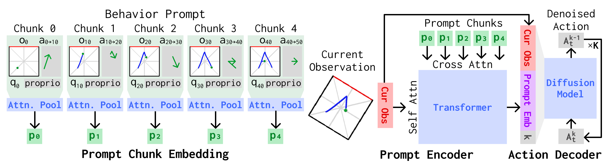
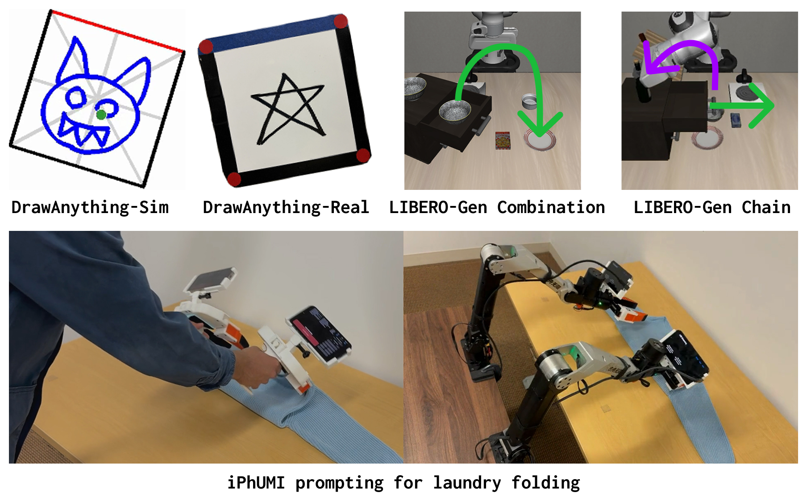

# Behavior Prompting Policy



Acompanying code for the research paper [Behavior Prompting Policy: Demonstrations as Prompts for Manipulation](https://behavior-prompting.github.io/).

Authors: [Austin Patel](https://austinapatel.github.io/), [Ben Pekarek](https://benpekarek.github.io/), [Joel Enrique Castro Hernandez](https://joel-ca.github.io/portfolio/), and [Shuran Song](https://shurans.github.io/)

For support email Austin Patel (auspatel@stanford.edu)

## About
This reposistory contains a number of useful components to aid with visuomotor policy and behavior prompting research:
- **Visuomotor diffusion policy training** --  support for language conditioning, goal image conditioning, and in-context behavior prompting
- **iPhUMI policy training** -- support for single arm and bimanual visuomotor policies
- **Robot deployment** -- support for  a diverse set of robots and sensors
- **LIBERO** -- policy training and evaluation
- **LIBERO-Gen** -- an extension to LIBERO that supports procedural generation of environments, tasks, and demonstrations automatically, including policy training, datasets, and evaluation
- **DrawAnything-Sim** -- a simulation environment to evaluate 2D drawing capability, including policy training, datasets, and evaluation

We take substantial care to make sure each component is cleanly and efficiently implemented and well documented.

If you are looking for the iPhUMI app and associated demonstration processing code, please look at the [separate iPhUMI repository](https://github.com/real-stanford/iPhUMI).

## Setup

Clone this repo with submodules
```bash
git clone --recurse-submodules git@github.com:real-stanford/behavior_prompting.git

# If you have already cloned without submodules:
git submodule update --init --recursive
```

Open workspace in VS Code:
```bash
code .vscode/behavior_prompting.code-workspace
# or File -> Open Workspace from File
```

Setup mamba env:
```bash
mamba env create -f environment.yml
mamba activate bp

# if you play to deploy on a real robot
mamba env create -f deps/real-env/env.yaml

# then select the respective Python interpreters in VS Code for both behavior prompting and real-env workspace folders. 
```

## Usage

We provide datasets, checkpoints, and implementations for all of the following:


Refer to the relevant section to get started:
- [iPhUMI](docs/iphumi.md)
- [Laundry Folding (iPhUMI)](docs/laundry_folding.md)
- [DrawAnything-Real (iPhUMI)](docs/drawanything_real.md)
- [DrawAnything-Sim](docs/drawanything_sim.md)
- [LIBERO](docs/libero.md)
- [LIBERO-Gen](docs/liberogen.md)
- [LIBERO(-Gen) in openpi](docs/libero_openpi.md)
- [Robot Deployment](docs/robot_deployment.md)
- [Helpers](docs/helpers.md)

## Ackowledgement
This code was made possible thanks to the following projects:
- [Diffusion Policy](https://github.com/real-stanford/diffusion_policy)
- [UMI](https://github.com/real-stanford/universal_manipulation_interface)
- [real-env](https://github.com/real-stanford/real-env)

## Citation
If you found this codebase useful in your research, please cite:
```
@article{patel2026bpp,
  title={Behavior Prompting Policy: Demonstrations as Prompts for Manipulation}, 
  author={Austin Patel and Ben Pekarek and Joel Enrique Castro Hernandez and Shuran Song},
  year={2026},
  journal={arXiv preprint arXiv:2606.30457},
  url={https://arxiv.org/abs/2606.30457}
}
```

## License
This repository is released under the MIT license. See [LICENSE](LICENSE) for more details.

## TODO
- [ ] Release support for real-time behavior prompting with iPhUMI. Currently we only have released support for the workflow involving: collect demonstration on iPhone -> export manually to computer -> process into dataset -> use to prompt policy. We plan to release support for direct wireless transfer of iPhone demonstration to enable: iPhone demonstration ->  prompt policy.